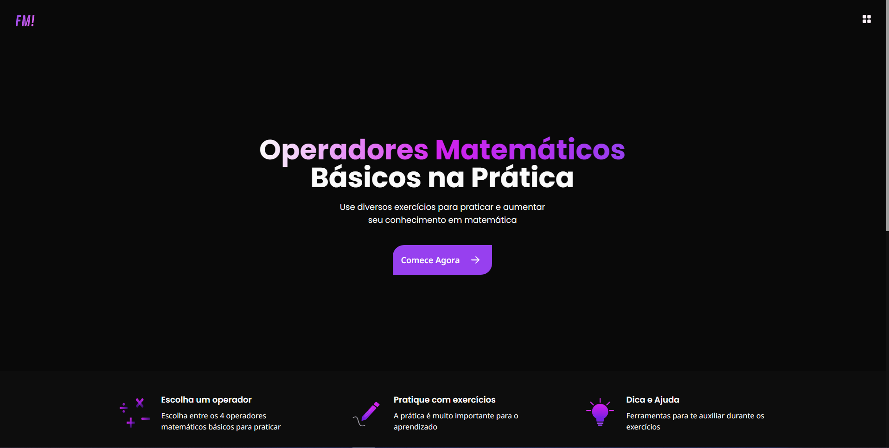
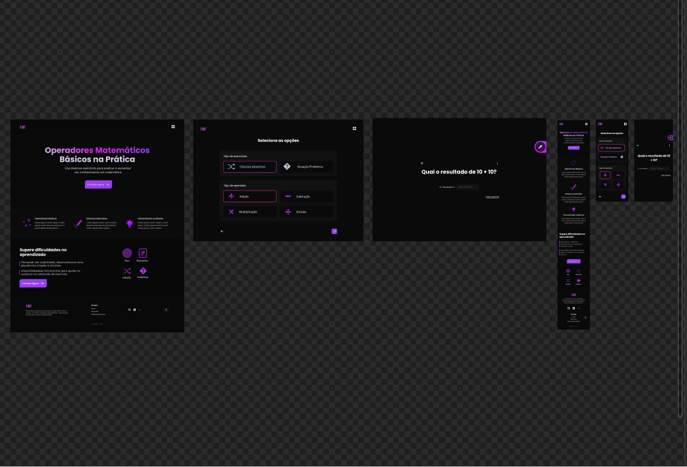

<h1 align="center">
    
    <br>
    FunMath! plataforma para praticar matemática.
</h1>

<h3 align="center">A plataforma FunMath! prover exercícios para os usuários colocar em prática e melhorar seus conhecimentos em matemática.</h3>

<div align="center">
  
</div>

<p align="center"><a href="https://fun-math.vercel.app/">Ver Projeto</a></p>

<h4 align="center">Exercícios especificos gerados no Client e outros consumidos da plataforma <a href="https://hygraph.com/">Hygraph</a> com uma API GraphQL.</h4>

<h2>Por que?</h2>

Cálculos com operadores básicos da matemática fazem parte do nosso dia-a-dia, mas muitas pessoas tem dificuldades, então a plataforma FunMath! possui exercícios para ajudar nessa questão, melhorando a interpretação e a lógica do usuário.

<h2>Tecnologias:</h2>

- [NextJS](https://nextjs.org/)
- [Typescript](https://www.typescriptlang.org/)
- [Hygraph](https://hygraph.com/)
- [GraphQL](https://graphql.org/)
- [ApolloClient](https://www.apollographql.com/docs/)
- [TailwindCSS](https://tailwindcss.com/)
- [HeadlessUI](https://headlessui.com/)

<h2>Maiores dificuldades:</h2>

- Usar o Canvas para desenho e deixa-lo responsivo.
- Formatar a resposta do usuário e tratar respostas incompletas.
- Mostrar tipos diferentes de exercícios dependendo da escolha do usuário.
- Organização do projeto, é um projeto grande, então componentizar e deixar legível é importante.

<h2>Prototipagem:</h2>

<div align="center">
  
</div>

<h4 align="center">Feito com <a href="https://www.figma.com/" target="_blank" rel="noreferrer">Figma</a></h4>

<h2>Rodando o projeto:</h2>

<small><strong>OBS: </strong>Alguns exercícios são consumidos de uma API privada criada no [Hygraph](https://hygraph.com). Você pode fazer o mesmo, basta criar uma conta e adicionar seus projetos.</small>

</br>

Você precisa ter o [Node](https://nodejs.org/en/), o [Git](https://git-scm.com/) e algum gerenciador de pacotes([NPM](https://docs.npmjs.com/downloading-and-installing-node-js-and-npm/) | [Yarn](https://classic.yarnpkg.com/lang/en/docs/install)) instalados em sua máquina.

```bash
1. Clone o repositório:
$ git clone https://github.com/gabriellima2/fun-math.git

2. Acesse a pasta e instale as dependências via terminal:
$ yarn / npm install
```

Crie uma conta no [Hygraph](https://hygraph.com/), [clone o projeto](https://app.hygraph.com/clone/ee61533f4fd64b3a83f9b3aea51effb4?name=FunMath!) e adicione seus exercícios.

```bash
3. Adicione as variáveis de ambiente:

	.env.local

	NEXT_PUBLIC_API_TOKEN=Seu Token de autenticação.
	NEXT_PUBLIC_API_URL=URL da sua API.

```

Agora basta rodar o projeto:

```bash
4. Inicie a aplicação em modo de desenvolvimento:
$ yarn dev / npm run dev

5. O servidor será aberto em http://localhost:3000
```

<p align="center">Projeto feito com 💙 por <a href="https://www.linkedin.com/in/gabriel-lima-860612236">Gabriel Lima</a></p>
