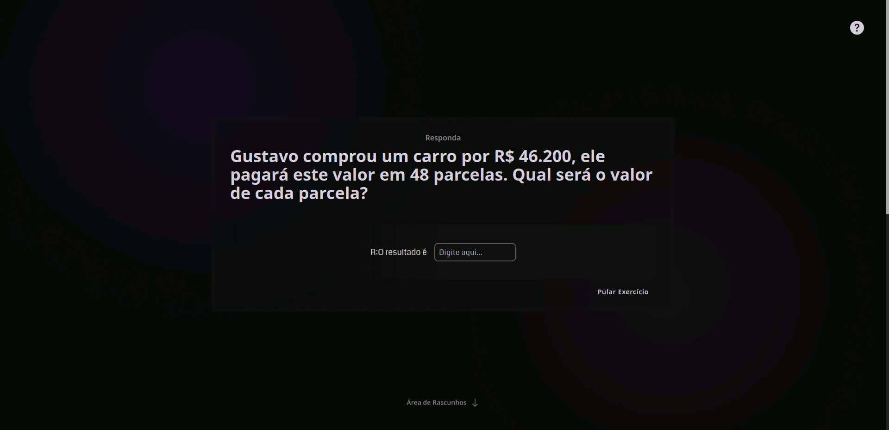

<h1 align="center">
    
    <br>
    FunMath! plataforma para praticar matemática.
</h1>

<h3 align="center">A plataforma FunMath! prover exercícios para os usuários colocar em prática e melhorar seus conhecimentos em matemática.</h3>

<div align="center">
  
</div>
<small><strong>OBS:</strong> Contraste da imagem estranho por causa do editor</small>

<p align="center"><a href="#">Em breve</a></p>

<h4 align="center">Exercícios especificos gerados no Client e outros consumidos da plataforma <a href="https://hygraph.com/" target="_blank" rel="noreferrer">Hygraph</a> com uma API GraphQL.</h4>


<h2>Por que?</h2>

Cálculos com operadores básicos da matemática fazem parte do nosso dia-a-dia, mas muitas pessoas tem dificuldades, então a plataforma FunMath! possui exercícios para ajudar nessa questão, melhorando a interpretação e a lógica do usuário.

<h2>Tecnologias:</h2>

- [NextJS](https://nextjs.org/)
- [Typescript](https://www.typescriptlang.org/)
- [Hygraph](https://hygraph.com/)
- [GraphQL](https://graphql.org/)
- [ApolloClient](https://www.apollographql.com/docs/)
- [TailwindCSS](https://tailwindcss.com/)
- [HeadlessUI](https://headlessui.com/)

<h2>Maiores dificuldades:</h2>

- Usar o Canvas para desenho e deixa-lo responsivo.
- Formatar a resposta do usuário e tratar respostas incompletas.
- Mostrar tipos diferentes de exercícios dependendo da escolha do usuário.
- Organização do projeto, é um projeto grande, então componentizar e deixar legível é importante.

<h2>Prototipagem:</h2>

<div align="center">
  
</div>

<h4 align="center">Feito com <a href="https://www.figma.com/" target="_blank" rel="noreferrer">Figma</a></h4>

<h2>Rodando o projeto:</h2>
<p><strong>OBS</strong> Só é possível rodar o projeto com exercícios gerados pelo Client, pois os outros são disponibilizados por minha API privada no Hygraph, mas você pode criar seus próprios exercícios e adicioná-los em sua conta no Hygraph, se desejar. <strong>Dito isso vamos lá!!!</strong></p>

</br>

Você precisar ter o Node, o Git e algum gerenciador de pacotes(NPM / Yarn) instalados em sua máquina.

```bash
1. Clone o repositório:
$ git clone https://github.com/gabriellima2/fun-math.git

2. Acesse a pasta e instale as dependências via terminal:
$ yarn / npm install

3. Inicie a aplicação em modo de desenvolvimento:
$ yarn dev / npm run dev

4. O servidor será aberto em http://localhost:3000
```

Caso esteja utilizando o Hygraph: <strong>Configure as variáveis de ambiente</strong>
```bash
	.env.local
	
	NEXT_PUBLIC_API_TOKEN=Seu Token de autenticação.
	NEXT_PUBLIC_API_URL=URL da sua API.
	
```


<p align="center">Projeto feito com 💙 por <a href="https://www.linkedin.com/in/gabriel-lima-860612236" target="_blank" rel="noreferrer">Gabriel Lima</a></p>

